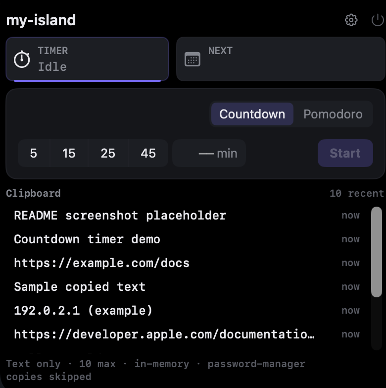

# my-island

A native macOS notch app — an **actionable-first** companion for the camera-housing notch.
The collapsed notch always shows live ambient state; it expands on hover or a global hotkey
into a panel for timers, clipboard, now-playing, and calendar — plus a planned Claude Code
"needs you" strip.

Actionable, not decorative — the notch surfaces what needs your attention and lets you act
on it (or jump straight to it) without switching windows.

> Built as a personal daily-driver on a 16" MacBook Pro, but nothing is hardware-specific:
> the notch layout is derived from Apple's public safe-area APIs, so it should work on any
> notched Mac (14"/16" MacBook Pro, notched MacBook Air) on **macOS Tahoe (26.x)** — those
> are just untested. A display with **no** notch is currently unsupported (the app stays
> dormant there; a notch-less fallback is planned, not built).



## Status

**Version 0.1.1 — in active development.** Not all features are built yet.

| Area | State |
|------|-------|
| Notch shell (always-on collapsed state, hover-to-expand, global hotkey) | ✅ Working |
| Timers / focus (pomodoro + countdown) | ✅ Working |
| Brightness + volume HUD | ✅ Working |
| Clipboard history (10 entries, password-manager copies skipped) | ✅ Working |
| Own visual design language ([`DESIGN.md`](DESIGN.md)) | ✅ Working |
| Calendar next-meeting countdown + one-click join | ✅ Working |
| Now Playing (Apple Music + browser audio) + live CoreAudio sound-wave | ✅ Working |
| Downloads / transfers progress | Backlogged |
| Claude Code "needs you" strip | Not built yet |

## Requirements

- Any Mac with a notch — 14"/16" MacBook Pro or a notched MacBook Air (developed & tested only on the 16" MBP) — running **macOS 26 (Tahoe)** or later. A non-notch display is not yet supported.
- **Xcode 26** (Tahoe SDK) with command-line tools
- [`xcodegen`](https://github.com/yonaskolb/XcodeGen) — `brew install xcodegen`

## Build & install

```bash
git clone https://github.com/maksim-101/my-island.git
cd my-island
./scripts/install.sh
```

`install.sh` generates the Xcode project from `project.yml`, builds Release, signs, and
installs `my-island.app` to `/Applications`. It runs as a menu-bar-only agent (no Dock
icon). Launch with:

```bash
open /Applications/my-island.app
```

Re-run `./scripts/install.sh` after pulling changes to update the installed app.

### Signing & permissions

The build signs with a **Developer ID** certificate if one is present in your keychain;
otherwise it falls back to **ad-hoc** signing. Ad-hoc signing mints a fresh code hash on
every build, and macOS keys its privacy (TCC) grants to that hash — so with ad-hoc signing
you may have to re-grant Calendar / Accessibility / Automation access after each reinstall.
A stable Developer ID identity keeps grants across rebuilds.

The app is **not notarized**. If you copy a build to another Mac (rather than building it
there), Gatekeeper will quarantine it. Clear the quarantine flag before first launch:

```bash
xattr -dr com.apple.quarantine /Applications/my-island.app
```

Accessibility is **optional** — it's used only to detect Safari fullscreen video (see "Known
Limitations" below) and, like the other grants, is forgotten on every ad-hoc rebuild. my-island
will never prompt for it; grant it manually in System Settings -> Privacy & Security ->
Accessibility if you want the Safari fullscreen-video discrimination.

### Diagnostic logging

The installed app writes nothing to the system log by default — that's deliberate, a
privacy/no-noise-in-production policy. For one debugging session, opt in on this machine,
restart the app (the setting is read once at startup), read the log, then restore silence:

```bash
defaults write com.maksim101.myisland MyIslandVerboseLogging -bool YES
# quit and relaunch my-island.app
log show --predicate 'subsystem == "com.maksim101.myisland" AND category == "FullscreenObserver"' --last 10m
defaults delete com.maksim101.myisland MyIslandVerboseLogging
# quit and relaunch my-island.app to restore silence
```

These lines record classification and status facts only — never what's playing, what's on
the calendar, or what was copied.

## Layout

```
Sources/App/        SwiftUI + AppKit app (NSPanel notch overlay, providers, views)
Core/               MyIslandCore SwiftPM package (shared primitives, unit-tested)
Vendor/             Vendored MediaRemote adapter (drives Now Playing)
scripts/            install.sh, dev-reset.sh (TCC reset), capture-nowplaying.sh
project.yml         XcodeGen spec — single source of truth for the Xcode project
DESIGN.md           Design tokens (colors, type, spacing) — the app's visual language
```

## Known Limitations

**Chromium-based browsers (Vivaldi, Chrome, Edge, Brave, Arc) never suppress the ambient
row, even when a video is genuinely fullscreen.** Chromium puts the *same* browser window
into macOS fullscreen for both ordinary Spaces-fullscreen browsing and fullscreen video
playback — measured identical window ID, Accessibility subrole, `AXFullScreen` state,
bounds and child roles in both cases, with no distinguishing signal anywhere in the
Accessibility API or the window list. my-island therefore cannot tell the two states apart
in Chromium and defaults to always showing the row there. This is a permanent platform
limitation, not a bug awaiting a future fix — see the project's RESEARCH notes for the full
measured state tables.

**Safari does expose a distinct fullscreen window for video**, so fullscreen video there
correctly hides the ambient row while ordinary Spaces-fullscreen browsing does not. This
discrimination requires the optional Accessibility permission (see "Signing & permissions"
above); without it, Safari behaves like Chromium and the row is never suppressed.

**Non-browser apps (IINA, QuickTime, TV.app, games, slideshows, presentations) hide the
ambient row on ordinary app-level fullscreen** — no Accessibility read is needed for these,
since app-fullscreen alone is a reliable signal for a chromeless, non-browser app.

**Brightness is read through a private, undocumented framework** (`DisplayServices`) —
there is no public API for this on macOS. If a future macOS update breaks the private
symbols this relies on, the brightness HUD row simply hides rather than crashing or
showing stale data.

## License

No license is currently specified. All rights reserved by the author.
